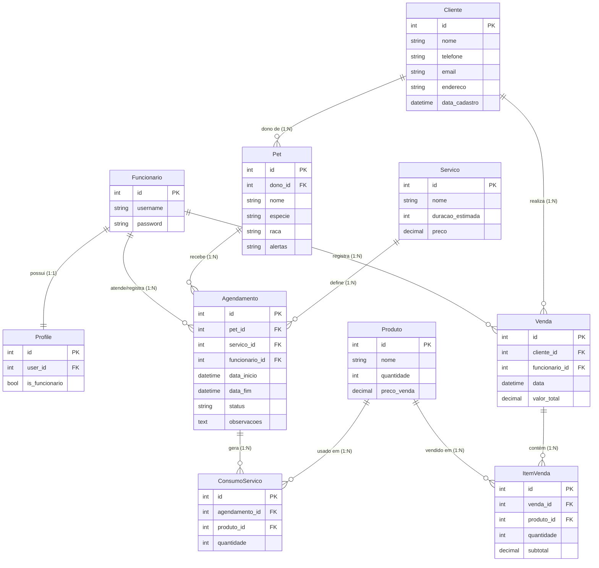

#  Sistema de Gestão para PetShop (ERP & Agendamento)

Sistema completo desenvolvido em **Django** e **Bootstrap 5** para gerenciamento de clínicas veterinárias e pet shops. O sistema controla desde o agendamento de serviços (banho e tosa) até vendas de produtos (PDV) e gestão de estoque.

---

##  Funcionalidades Principais

- ** Controle de Acesso:** Login via E-mail, cadastro de funcionários e perfis de acesso.
- ** Agenda Inteligente (Kanban):**
  - Visualização por colunas (Marcado, Em Serviço, Pronto).
  - Navegação por datas.
  - Alerta visual de serviços atrasados.
- ** Ponto de Venda (PDV):**
  - Venda de produtos rápida.
  - Baixa automática de estoque.
- ** Gestão de Serviços:**
  - Cadastro de Clientes e Pets.
  - Consumo interno (produtos gastos durante o banho/tosa).
  - Checklist de finalização e observações.
- ** Histórico: **
  - Histórico completo de vendas e atendimentos.
---

## Banco de Dados (Diagrama ER)

Abaixo está a estrutura do banco de dados relacional do sistema:

Como Rodar o Projeto

Siga os passos abaixo para executar o sistema localmente.

1. Clonar o repositório
git clone <link-do-repositorio>
cd sistema-petshop

2. Criar e ativar o ambiente virtual

Windows

python -m venv venv
venv\Scripts\activate

Linux / Mac

python3 -m venv venv
source venv/bin/activate

3. Instalar dependências

Instale o Django manualmente (caso não exista requirements.txt):

pip install django

4. Configurar o Banco de Dados

O projeto utiliza SQLite, já incluso no arquivo db.sqlite3.
Caso necessário, execute as migrações:

python manage.py migrate

5. Criar um Superusuário (Admin)

Para acessar o painel administrativo do Django:

python manage.py createsuperuser

6. Iniciar o Servidor
python manage.py runserver

Acesse no navegador:
👉 http://127.0.0.1:8000/
