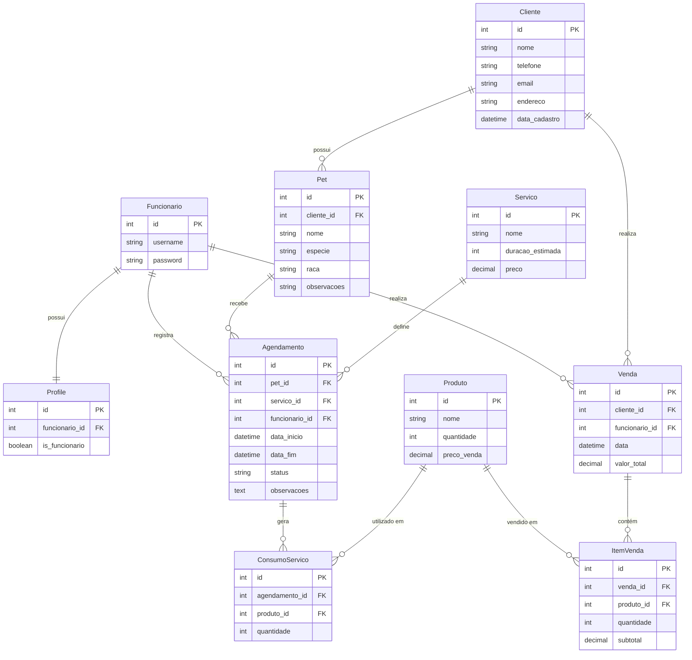

# Sistema de Gestão para PetShop (ERP & Agendamento)

Sistema completo desenvolvido em **Django** e **Bootstrap 5** para gerenciamento de clínicas veterinárias e pet shops.  
O sistema permite o controle de agendamentos de serviços (banho e tosa), vendas de produtos (PDV), gestão de estoque e administração de usuários.

---

## 🎯 Objetivo do Sistema

Desenvolver um sistema web para aplicar os conceitos estudados na disciplina **Programação Web II**, contemplando:
- Autenticação de usuários
- Modelagem de banco de dados relacional
- Organização em camadas (MVC/MVT)
- Persistência de dados

---

## 🚀 Funcionalidades Principais

- **Controle de Acesso**
  - Login via e-mail
  - Cadastro de funcionários
  - Perfis de acesso

- **Agenda Inteligente (Kanban)**
  - Visualização por colunas (Marcado, Em Serviço, Pronto)
  - Navegação por datas
  - Alerta visual de serviços atrasados

- **Ponto de Venda (PDV)**
  - Venda rápida de produtos
  - Baixa automática de estoque

- **Gestão de Serviços**
  - Cadastro de clientes e pets
  - Consumo interno de produtos durante o atendimento
  - Checklist de finalização e observações

- **Histórico**
  - Histórico completo de vendas e atendimentos

---

## 🗄️ Banco de Dados (Diagrama ER)

Abaixo está a estrutura do banco de dados relacional do sistema:

Como Rodar o Projeto

Siga os passos abaixo para executar o sistema localmente.

1. Clonar o repositório
git clone https://github.com/Ryanz1N/Sistema-petshop1.git
cd Sistema-petshop1

2. Criar e ativar o ambiente virtual

Windows

python -m venv venv
venv\Scripts\activate

Linux / Mac

python3 -m venv venv
source venv/bin/activate

3. Instalar dependências

Instale o Django manualmente (caso não exista requirements.txt):

pip install django

4. Configurar o Banco de Dados

O projeto utiliza SQLite, já incluso no arquivo db.sqlite3.
Caso necessário, execute as migrações:

python manage.py migrate

5. Criar um Superusuário (Admin)

Para acessar o painel administrativo do Django:

python manage.py createsuperuser

6. Iniciar o Servidor
python manage.py runserver

Acesse no navegador:
👉 http://127.0.0.1:8000/
